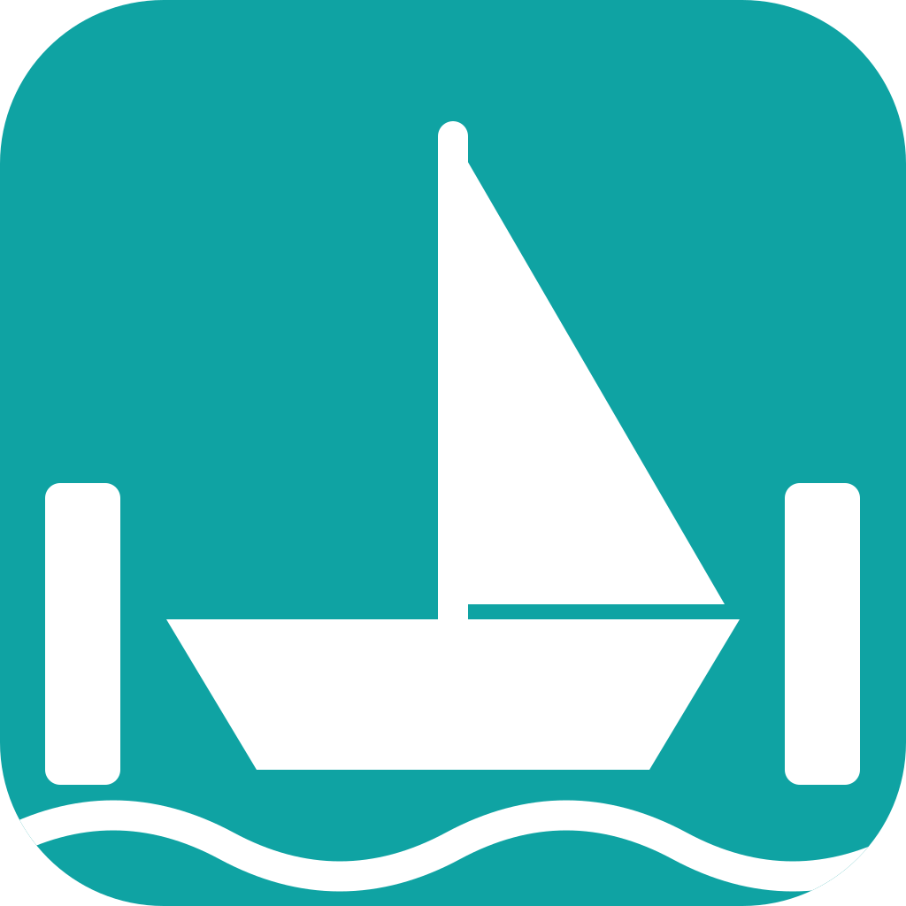
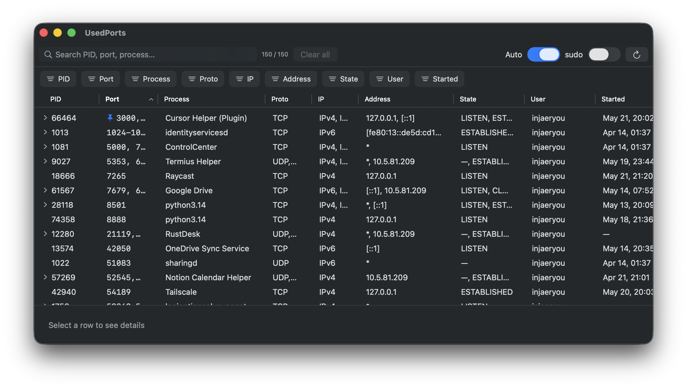
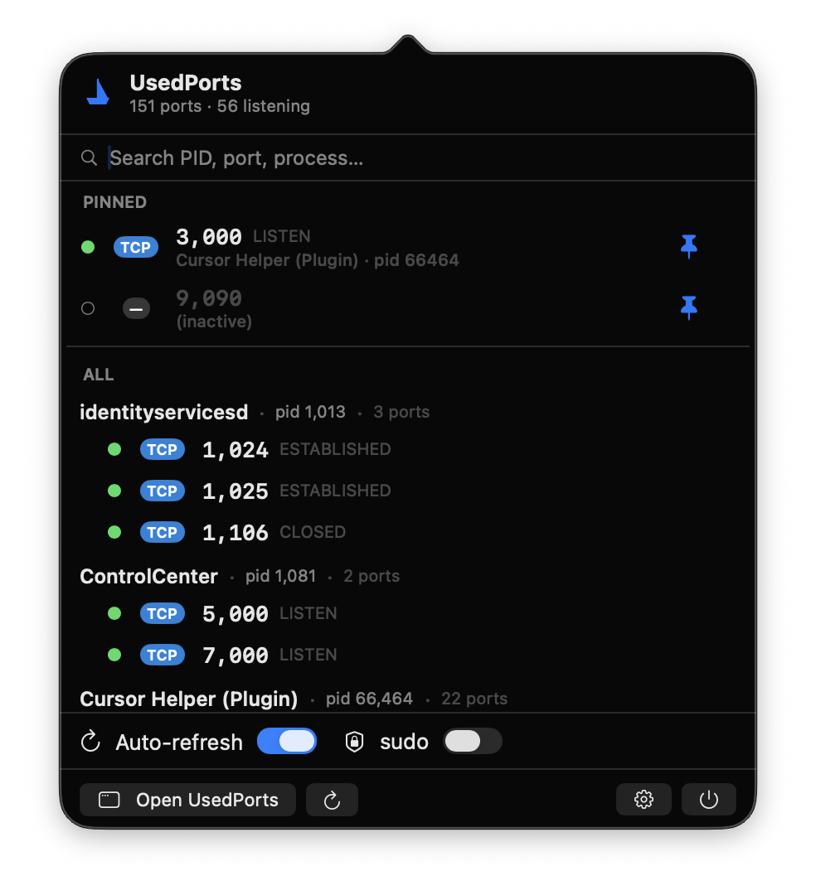

# UsedPorts

A SwiftUI macOS app that lists and manages TCP/UDP ports in use on your system.



## Install

### Homebrew (recommended)
```sh
brew tap UsedPorts/tap
brew install --cask usedports
```

### Manual download
Grab the latest `.zip` from the [Releases](https://github.com/UsedPorts/UsedPorts/releases) page, unzip, and move `UsedPorts.app` to `/Applications`.

On first launch, if Gatekeeper blocks the app, right-click → "Open" once to allow it.

## Build

Requirements:
- macOS 14+ (Sonoma)
- Xcode 15+
- `xcodegen` (`brew install xcodegen`)

```sh
xcodegen generate
open UsedPorts.xcodeproj
# Cmd+R
```

Command-line build:
```sh
xcodebuild -project UsedPorts.xcodeproj -scheme UsedPorts -destination 'platform=macOS' build
```

Run the test suite:
```sh
xcodebuild test -project UsedPorts.xcodeproj -scheme UsedPorts -destination 'platform=macOS'
```

## Features

- Menu-bar resident + detail window, sharing the same data
- Per-column sort and filter (numeric range, multi-select, text + regex, time range)
- Global search bar
- Row actions: Kill (SIGTERM/SIGKILL), copy PID/Port/Path, reveal in Finder
- Kill result polling confirms the process actually exited — escalates to SIGKILL if it doesn't
- sudo mode: authenticate once, stays active until the app quits (uses the root helper `uph`)
- Auto/manual refresh toggle

### Menu bar

A compact status item shows pinned ports at a glance:


Click it to open the popover — search, pinned section, and the full process tree:



## Settings reference

General toggles affect both the main table and the menu-bar popover; the rest are scoped to one surface or the other.

### General

| Setting | Scope | Behavior |
|---|---|---|
| Launch at Login | App | Registers with `SMAppService`. Toggle reflects the actual system state (rolled back if the registration call fails). |
| Hide repeated process names | Menu bar only | When **Group by PID is off**, adjacent rows sharing a PID suppress the second-line `process · pid` label. Has no effect when Group by PID is on (header already shows process · pid). |
| Hide duplicate rows | Both (different keys) | Collapses rows that would look identical. Dedup key differs by surface — see [dedup key table](#hide-duplicate-rows-dedup-key) below. |
| Group by PID | Both | Multi-port processes collapse into a parent row. **Main table:** disclosure parent + children sorted by user's active column. **Menu bar:** `process · pid` header + indented child rows (one per port). Single-port PIDs stay as a normal leaf row. Pin remains per-port; kill targets the PID. |

#### Hide duplicate rows: dedup key

Only matters when the toggle is on. Rows differing only by file descriptor (`lsof` reports each fd separately; `dup`/multi-listener sockets) otherwise appear as duplicates.

| Surface | Dedup key | Why |
|---|---|---|
| Main table | `(pid, port, proto, ipFamily, address, state, user, process)` | Strict — the table can show any of those columns, so only rows matching on every visible column count as duplicates. |
| Menu-bar popover | `(pid, proto, port)` | Coarser — popover doesn't expose address / state / user, so rows differing only on those would look identical to the user. |

### Menu Bar

| Setting | Behavior |
|---|---|
| Show in Menu Bar | Toggles `NSStatusItem` visibility. |
| Title format | Status-item title text (next to the icon), not the popover. *Port only* → port numbers of pinned ports. *Port + process* → port number + owning process name. Popover always shows process info regardless. |

### Refresh

| Setting | Behavior |
|---|---|
| Auto refresh | Master switch for the polling stream. When off, refreshes only on manual invocation (toolbar Refresh, popover Refresh, kill-result polling). |
| Foreground refresh interval | Base poll cadence for `lsof` while the main window is visible. 1 / 3 / 5 seconds. |
| Background refresh interval | Behavior while the main window is hidden: *Same as foreground* / *Slower (2× interval, default)* / *Pause* (stop until show). |

### Language

| Setting | Behavior |
|---|---|
| Language | *System* uses the system locale; *English* / *한국어* pin `AppleLanguages`. Effective on next app launch. |

### Updates

| Setting | Behavior |
|---|---|
| Automatically check for updates | Sparkle background check; uses the repo's `appcast.xml`. |
| Check Now | Manual check. Disabled while a check is in flight. |

### Help

| Setting | Behavior |
|---|---|
| Save Diagnostic Log… | Writes a redacted log bundle to a user-chosen location. |
| Report Issue on GitHub… | Opens a pre-filled GitHub issue and copies the diagnostic log to the clipboard. |

## Architecture

```
App/                — SwiftUI app (UsedPorts target)
  Views/            — SwiftUI views
  ViewModels/       — sort / filter / stream logic
  Domain/           — PortScanner, KillSupervisor, PrivilegeManager, ElevatedHelper
  Infrastructure/   — CommandRunner, LsofParser, PsParser
Shared/             — Models, HelperProtocol (shared by app, helper, tests)
Helper/uph/         — privilege-elevation helper CLI
Tests/              — XCTest unit + integration tests
```

## Operating modes

| Mode | Data source | Privileges |
|---|---|---|
| Normal | Direct `lsof -nP -iTCP -iUDP -F pcuLnPT` | Current user |
| sudo | `osascript ... with administrator privileges` launches the `uph` helper; JSONL IPC | root (held while the app is running) |

## Auto-update

The app uses [Sparkle 2.x](https://sparkle-project.org/). Updates are pulled from `appcast.xml` published at the repo root; Settings → Updates lets you toggle auto-checks or run "Check Now".

## Notes

- App Sandbox is disabled (needs to run external commands and signal other PIDs)
- Code signing: ad-hoc, Hardened Runtime on, no notarization (local builds only)
- Gatekeeper may warn on first launch — right-click → Open once to allow it
