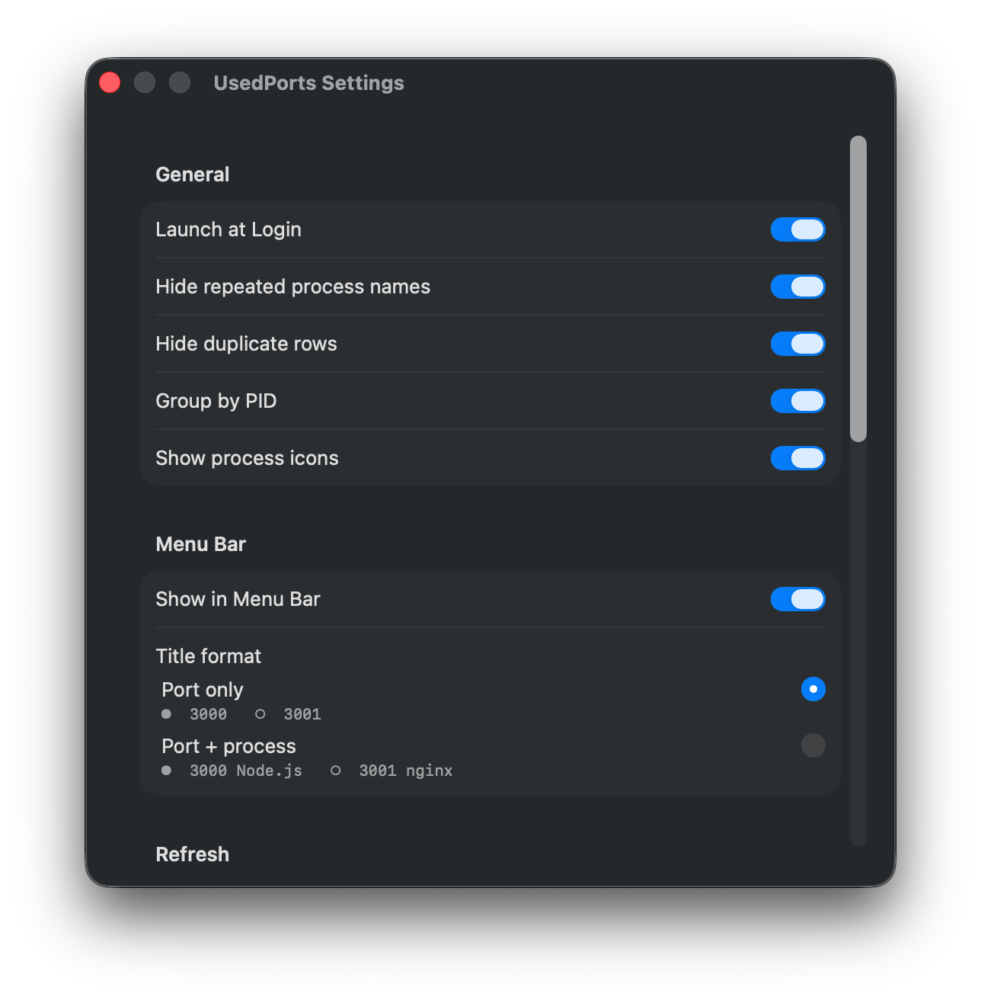

# Settings reference

General toggles affect both the main table and the menu-bar popover; the rest are scoped to one surface or the other.

## General

| Setting | Scope | Behavior |
|---|---|---|
| Launch at Login | App | Registers with `SMAppService`. Toggle reflects the actual system state (rolled back if the registration call fails). |
| Hide repeated process names | Menu bar only | When **Group by PID is off**, adjacent rows sharing a PID suppress the second-line `process · pid` label. Has no effect when Group by PID is on (header already shows process · pid). |
| Hide duplicate rows | Both (different keys) | Collapses rows that would look identical. Dedup key differs by surface — see [dedup key table](#hide-duplicate-rows-dedup-key) below. |
| Group by PID | Both | Multi-port processes collapse into a parent row. **Main table:** disclosure parent + children sorted by user's active column. **Menu bar:** `process · pid` header + indented child rows (one per port). Single-port PIDs stay as a normal leaf row. Pin remains per-port; kill targets the PID. |
| Show process icons | Both | Displays each process's app icon next to its row in the main table and the menu-bar popover. When off, rows show text only. |

### Hide duplicate rows: dedup key

Only matters when the toggle is on. Rows differing only by file descriptor (`lsof` reports each fd separately; `dup`/multi-listener sockets) otherwise appear as duplicates.

| Surface | Dedup key | Why |
|---|---|---|
| Main table | `(pid, port, proto, ipFamily, address, state, user, process)` | Strict — the table can show any of those columns, so only rows matching on every visible column count as duplicates. |
| Menu-bar popover | `(pid, proto, port)` | Coarser — popover doesn't expose address / state / user, so rows differing only on those would look identical to the user. |

## Menu Bar

| Setting | Behavior |
|---|---|
| Show in Menu Bar | Toggles `NSStatusItem` visibility. |
| Title format | Status-item title text (next to the icon), not the popover. *Port only* → port numbers of pinned ports. *Port + process* → port number + owning process name. Popover always shows process info regardless. |

## Refresh

| Setting | Behavior |
|---|---|
| Auto refresh | Master switch for the polling stream. When off, refreshes only on manual invocation (toolbar Refresh, popover Refresh, kill-result polling). |
| Foreground refresh interval | Base poll cadence for `lsof` while the main window is visible. 1 / 3 / 5 seconds. |
| Background refresh interval | Behavior while the main window is hidden: *Same as foreground* / *Slower (2× interval, default)* / *Pause* (stop until show). |

## Language

| Setting | Behavior |
|---|---|
| Language | *System* uses the system locale; *English* / *한국어* pin `AppleLanguages`. Effective on next app launch. |

## Updates

| Setting | Behavior |
|---|---|
| Automatically check for updates | Daily background check via `brew outdated`. Only shown when UsedPorts is managed by Homebrew. |
| Check Now | Manual check. Disabled while a check is in flight. |
| Update to … | Runs `brew upgrade usedports` and relaunches the app. Shown when a newer version is available. |

## Help

| Setting | Behavior |
|---|---|
| Save Diagnostic Log… | Writes a redacted log bundle to a user-chosen location. |
| Report Issue on GitHub… | Opens a pre-filled GitHub issue and copies the diagnostic log to the clipboard. |
